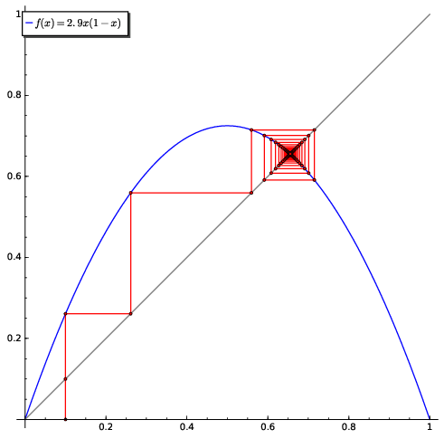
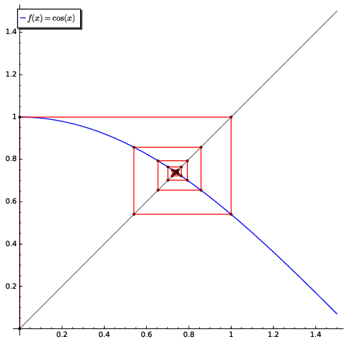

---
jupyter:
  title : 'Pràctica 5: Funcions i programes'
  authors: [ "name" : "Marc Masdeu", "name" : "Xavier Xarles" ]
  jupytext:
    text_representation:
      extension: .md
      format_name: markdown
      format_version: '1.3'
      jupytext_version: 1.14.0
  kernelspec:
    display_name: SageMath 9.6
    language: sage
    name: sagemath
---

# Funcions i programes

## Elements d'un *programa*

Hi ha moltes situacions en les que una funció del tipus anterior
(`x -> f(x)`) no és suficient per al problema que s'està tractant. És
força normal que per tal d'obtenir un resultat es necessitin una sèrie
d'instruccions encadenades, que produeixen alguns valors intermedis (que
cal tenir guardats en variables locals), que aquest flux d'instruccions
requereixi la comprovació de certes condicions per tal d'executar blocs
diferents, que un mateix bloc d'instruccions es repeteixi un cert nombre
de cops (o fins que es verifiqui una certa condició), etc.

En aquests casos s'hauran de definir funcions de tipus programa. La
sintaxi per tal d'introduir aquests objectes és la de Python (ja que, en
el fons, és el que utilitza **SageMath** per a
totes les seves instruccions).

En qualsevol cas, independentment del llenguatge que s'utilitzi els
ingredients necessaris, com a mínim, per a fabricar un programa són
instruccions que permetin realitzar tests i decidir, en funció del
resultat, executar una acció o una altra (comparacions) i algun
mecanisme que repeteixi tants cops com sigui necessari un cert bloc
d'instruccions (bucles de repetició).

Un fet molt important del Python és que els espais són molt importants
(i no com amb el LaTeX, que posar un espai o mil és el mateix). Quan es
fa una nova linea dins d'un condicional, un bucle, una funció tipus
programa, etc, s'ha de posar indentada: el
**SageMath** ho fa automàticament normalment,
però és important saber que aquesta indentació és clau, i es
recomana que estigui formada per 4 espais.

## Execució condicional (`if`)

Com en gairebé tots els llenguatges de programació, la instrucció que
realitza un test i, en funció del resultat executa una instrucció o una
altra és `if`. Ja s'ha vist una versió d'aquesta instrucció com a part
del constructor de llistes. L'exemple que ve a continuació mostra com
s'ha d'escriure una instrucció d'aquest tipus per tal de realitzar una
acció o una altra segons el resultat d'un test:

```sage
a = 3
b = 0
if a == 4:
    b = a + 1
    print("Modificant b")
print(f'{a = }')
print(f'{b = }')
```

En aquest cas es veu que, en ser el valor de `a` igual a 3, no es
produeix cap canvi. Mentre que en aquesta altra situació

```sage
var('a b')
a = 4
if a == 4:
    b = a + 1
    print("Modificant b")
print(f'{a=}')
print(f'{b=}')
```

es veu com apareix el text `Modificant b` i el valor de `b` passa a ser
5 ja que s'executen les dues instruccions corresponents.

Segurament queda clar, després d'aquests dos exemples, que just darrera
del `if` apareix la condició que es comprovarà, en forma d'equació, per
tal d'executar la llista d'instruccions que va a continuació dels ":".
Aquesta llista queda determinada (Python) pel fet que les instruccions
corresponents s'escriuen indentades i quan s'acaben les instruccions
d'execució condicional es tornen a escriure sense aquesta indentació
(les interfícies de **SageMath** solen indentar automàticament tot el que va
darrera de l'`if` i, per tant, no cal indentar explícitament el
bloc ja que el format apareix per ell mateix).

Naturalment, la instrucció `if` també permet definir quines instruccions
s'executen quan el test dona un valor fals (posant un `else`) i, fins i
tot, encadenar dos o més blocs condicionals.

Per exemple, el següent programa 

```sage
a = 2
if a < 3:
    print (f"{a} és menor que 3")
else:
    print (f"{a} no és menor que 3")
```

respon "2 és menor que 3" ja que la primera instrucció dona el valor
de 2 a la variable `a`. Si canviem la primera instrucció per `a = 5`,
respondrà "5 no és menor que 3".

Un exemple una mica més complet que els anteriors consisteix a definir
un bloc d'instruccions que emula la funció *signe* (dona com a resultat
$1$ si el seu argument és positiu, $-1$ si és negatiu i $0$ si aquest
argument és $0$). Aquí hem usat la funció `elif`, que és una contracció
de `else if`.

```sage
a = 3
if a > 0:
    print(1)
elif a < 0:
    print(-1)
elif a == 0:
    print(0)
else:
    print("No s'ha pogut comparar")
```

Per tal de comprovar el funcionament d'aquestes instruccions en
diferents situacions, canvieu el `a = 3` per `a = -pi`, per `a = 0` o per un
`var(’a’)` i noteu com canvien els resultats.

## Iteracions/repeticions/bucles

Una altra estructura bàsica de programació és la de les iteracions
(repetició d'un bloc d'instruccions un cert nombre de cops, utilitzant
els valors obtingut en cada repetició per tal de realitzar els càlculs
en la següent,...). Ja hem vist que per a generar llistes podem
utilitzarel `for`. Fem primer un exemple calculant la suma dels quadrats
de 1 a 100:

```sage
suma = 0
for a in range(1,101):
    suma += a^2
print(suma)
```

Com en les instruccions `if`, primer marquem quines són les condicions de
repetició (en particular el rang de variació de l'índex) acabant amb `:`
i les instruccions que es realitzen en cada repetició s'escriuen
utilitzant la indentació per tal de definir el bloc. El rang per l'índex
seran llistes de valors obtingudes amb una instrucció `range` o del
tipus `[a..b]`.

**Nota:** Ja existeix una funció específica (`sum`) per a sumar una
llista:
```sage
sum(a^2 for a in range(101))
```

**Nota2:** Sovint quan treballem amb
**SageMath** és millor utilitzar la funció
`srange` que la funció `range`: la diferència és que la primera produeix
enters de **SageMath** i la segona enters de
**Python**.  Amb els enters de Python no hi ha definits certs mètodes per
decidir, per exemple, si un nombre és primer, o per factoritzar-lo. Per
exemple, si volem la suma dels quadrats dels nombres primers entre 1 i
100 i posem

```sage
sum(a^2 for a in range(101) if a.is_prime())
```

no funciona, però sí si posem

```sage
sum(a^2 for a in srange(101) if a.is_prime())
```

Observeu que quan assigneu un valor enter a una variable,
**SageMath** el considera un enter de Sage i no de
Python, però en canvi la funció `range` retorna enters de Python.


En altres situacions, el bloc d'instruccions que s'ha de repetir, en
comptes de dependre del valor d'un índex, depèn d'una condició lligada a
algun dels càlculs que s'estan realitzant. En aquests casos utilitzarem
la instrucció és `while`.


Per exemple, si volem fer una llista `L` dels primers menors que 20 en
ordre invers (de gran a petit) podem fer

```sage
L = []
a = 20
while a > 0:
    if a.is_prime():
		L.append(a)
    a -= 1
print(L)
```

**Exercici:** Podeu pensar alguna manera de fer això amb un simple
`for`? I amb comprensió de llistes?

-- begin hide
```sage
L = []
for p in srange(20,1,-1):
    if p.is_prime():
        L.append(p)
```
```sage
L = [p for p in srange(20,1,-1) if p.is_prime()]
```
-- end hide

Un altre exemple més sofisticat: és ben conegut que l'equació
$x=\cos(x)$ té una solució que es pot aproximar tant com es vulgui
iterant el procés $x\leadsto \cos(x)$. Podem obtenir una aproximació a
aquesta solució iterant el procés fins que dos valors consecutius
difereixin en una quantitat fixada prèviament (tolerància). Una forma
d'implementar aquest càlcul pot ser el següent:

```sage

di=1e-8 # Grau d'aproximacio entre iteracions consecutives que es busca
s = 0. # Valor inicial
sa = s+1 # Valor inicial per a l'aproximacio anterior
         # (arbitrari i lluny del valor inicial)
k = 0 #Variable que controla el nombre de repeticions

while abs(s-sa) > di:
    k += 1; sa = s; s = cos(s)
    print(f'Iteració {k}, {s = }')
show(sa, s)
```

És fàcil que un bucle de repetició `while` es converteixi en un bloc que
no s'atura mai (si no s'ha controlat bé que la condició de repetició
realment s'acabi per complir en algun moment raonable). Per tant, el
càlcul anterior resultarà més correcte si es controla el nombre de cops
que s'ha de repetir el procés. Per exemple:

```sage

di = 1e-8; s=0.; sa = s+1; k=0

mxi = 20 # Nombre màxim de repeticions del proces

while abs(s-sa) > di and k < mxi:
    k+ = 1; sa = s; s = cos(s)
    print(f'Iteració {k}, {s = }')

# Es controla si s'han esgotat les repeticions previstes
if k == mxi:
    print(f"Despres de {k} iteracions,")
    print("les dues ultimes aproximacions difereixen en")
    print("S'ha arribat al maxim d'iteracions previstes!!!")
    print("No és segur que el valor sigui prou ajustat")

show(sa, s)
```

Encara que si deixem repetir més cops tornem a tenir un resultat prou
ajustat.

```sage

di = 1e-8; s = 0.; sa = s + 1; k = 0; mxi = 50

while abs(s-sa) > di and k < mxi:
    k += 1; sa = s; s = cos(s)
    if k == mxi:
        print("S'ha arribat al maxim d'iteracions previstes!!!")
        print("No és segur que el valor sigui prou ajustat")
    else:
        print(f"Després de {k} iteracions, les dues últimes aproximacions difereixen en")
        print(f"{abs(s-sa).n(digits=3)}, i són: {sa}, {s}")
```

De forma semblant a l'anterior, es pot aturar l'execució d'un `for`
abans del nombre de repeticions previst en un principi introduint una
instrucció `break` en el punt on es vulgui acabar (tot i que hi ha
programadors que no recomanen la utilització del `break` per ser poc
estructurada).

Per exemple, podem localitzar el nombre primer que és immediatament
inferior a 1000 (càlcul que ja realitza la funció `previous_prime`)
amb les instruccions següents: ``

```sage

a = 1000
for p in [a-1, a-2..1]:
    if p.is_prime():
        break
print(p)
```

que donarà el mateix resultat que

```sage
print(a.previous_prime())
```

També ho podem fer utilitzant un `while`:

```sage
p = a-1
while not p.is_prime():
    p -= 1
print(p)
```

(fora que la funció del
**SageMath** `previous_prime` està molt més
optimitzada i per tant és molt més ràpida).


**Exercici:** Proveu de fer el mateix per a trobar el nombre primer immediatement
superior a `a = 524`, o sigui el més petit dels que són més grans que
`524`. La funció de **SageMath** corresponent és
`next_prime`.


-- begin hide

**Opció 1:** amb un `while`. Aquí cal saber que hi ha infinits primers,
i per tant el `while` s'acaba algun dia.

```sage
a = 1009
p = a+1
while not p.is_prime():
    p += 1
print(p)
```

**Opció 2:** amb un `for`; el problema és saber fins a on hem d'anar
per a trobar un nombre primer. Aquí podem fer servir per exemple
un resultat que diu que per a tot $n>1$, hi ha sempre un nombre
primer $p>n$ amb $p\le 2n$ (es diu postulat de Bertrand, i podeu
buscar informació per internet).

```sage
for p in srange(a+1,2*a+1):
    if p.is_prime():
        break
print(p)
```

-- end hide


## Funcions de tipus programa

Quan es vol definir una funció que en la seva avaluació necessiti
combinar més d'una instrucció, combinar blocs en els que hi hagi
condicionals, repeticions o es necessitin variables temporals per
guardar resultats que s'han d'utilitzar en alguna fase posterior
d'aquesta avaluació, el mecanisme de les funcions simbòliques
(`f(x)=.....`) és clarament insuficient (i, de fet, tampoc es pot
incloure de forma obvia un condicional `if` dins la definició d'una
funció). En aquestes situacions cal generar objectes de tipus programa
utilitzant l'estructura `def`.

Vegem un exemple d'aquesta estructura. La següent funció retornarà
`True` o `False` (els booleans) depenent de si el nombre que li passem
és primer i dona residu 1 si el dividim per 3 (equivalentment, al
restar-li 1 és divisible per 3). Hem utilitzat una funció de Python molt
important que és `a % b`, que si $a$ i $b$ són dos nombres enters $>0$,
retorna el residu de dividir $a$ entre $b$ (en una propera pràctica
l'estudiarem amb més detall).

```sage
def primer3(n):
    if n.is_prime() and  n % 3 == 1:
        return True
    else:
        return False
```

Com a comentari, vegeu que rere la instrucció `return` hi ha el que
volem que retorni la funció, en cada cas. Un cop executa un `return` la
funció s'acaba, i per tant també es pot escriure

```sage
def primer3(n):
    if n.is_prime() and n % 3 ==1:
        return True
    return False
```

De fet, com que dins del condicional hi ha unes funcions que ja donen un
booleà, encara ho podriem fer més concís escrivint simplement 

```sage
def primer3(n):
    return n.is_prime() and n % 3 == 1
```

Quan tenim una funció tan curta, podem escriure-la també en notació *lambda*:

```sage
primer3 = lambda n : n.is_prime() and n % 3 == 1
```

Cal dir que aquesta funció es podria optimitzar per tal que comproves
primer si el valor de `n` és un nombre enter de **SageMath**, i retornés `False`
o un error si no ho fos; això es pot fer usant la funció `type`, que
retorna el "tipus" del valor passat: en el cas que ens interessa,
ha de ser de tipus `Integer`.

```sage
def primer3(n):
    if type(n) != Integer:
        return False
    return n.is_prime() and n % 3 == 1
```

Aquesta funció ara la podem utilitzar per a fer la llista dels nombres
primers menors que 100 i amb resta 1 al dividir per 3:


```sage
L = [n for n in range(100) if primer3(n)]
```

Les funcions, en principi, poden no necessitar cap dada inicial ni tant
sols retornar res (en aquest cas, retornen un tipus buit, que s'anomena `None`). Per exemple:

```sage
def hola():
    print('Hola que tal!') # No retorna res, simplement escriu una cadena.
ret = hola()
print(f'{ret = }')
```

Un altre exemple més sofisticat per a fer els càlculs de les iteracions
de la funció cosinus que ja han aparegut anteriorment defininint una
funció designada com `ICos`. Aquesta funció acceptarà tres arguments (el
primer serà el punt inicial de les iteracions, el segon el control de
precisió i el tercer el nombre màxim d'iteracions que es preveuen), va
escrivint els resultats intermedis i dona com a valor resultant (aquesta
és la missió de la instrucció `return`) el de l'última iteració (de
forma que, a part de veure tot el procés dels càlculs, es pot assignar a
la variable `valor` aquest resultat final). Fixeu-vos que, tot i que
cada cop que executeu una instrucció `ICos` apareixeran els resultats
intermedis i el resum final, el **resultat** o **valor** de la funció
corresponent als arguments que heu utilitzat és el valor de `s`.

```sage
reset()

def ICos(origen, precisio, maxit):
    s = origen.n()
    sa = s+1
    k = 0
    print(45 * '*')
    while abs(s-sa) > precisio and k < maxit:
        k += 1; sa = s; s = cos(s)
        print(f'Iteracio {k}, {s = }')
        if k == maxit:
            print("S'ha arribat al maxim d'iteracions previstes!!!")
            print("No es segur que el valor sigui prou ajustat")
            print("El resultat correspon a l'ultim valor obtingut.")
        else:
            print(f"Despres de {k} iteracions,les dues últimes ")
            print(f"aproximacions difereixen en {abs(s-sa).n(digits=3)}, i són: {sa}, {s}")
            print(45 * '*')
    return s
```
```sage
valor = ICos(pi/3, 0.000001, 100)
valor
```

Noteu que totes les variables que reben valors en la descripció de
`ICos` només tenen sentit mentre s'està avaluant la funció i que, un cop
s'ha acabat l'execució del programa, tornen al seu estat anterior. (Se
sol dir que són variables *locals*.). Per exemple, `k`, `s`, `sa` i
`origen` en la funció anterior. Si la variable ja tenia un valor
assignat, no canvia. Per exemple ``

```sage
k=10
ICos(2,0.001,20)
print(k)
```

## Fer *experiments* utilitzant programes

Un dels avantatges de tenir un llenguatge de programació a l'abast és
que es poden realitzar amb facilitat experiments (numèrics) per a
verificar propietats o plantejar qüestions que poden requerir molts
càlculs (encara que siguin molt simples en el seu enunciat).

Una qüestió d'aquest tipus molt famosa és la coneguda com Conjectura de
Collatz (o també Conjectura del $3x+1$) que afirma:

> Independentment del valor inicial que es prengui, el procés iteratiu
> consistent a dividir per $2$ el valor actual, si és parell, o
> multiplicar-lo per $3$ i després sumar $1$, si és imparell, acabarà
> sempre en la successió $4, 2, 1, 4, 2, 1,\ldots$

Aquesta afirmació encara és manté en l'actualitat com una conjectura (no
s'ha pogut provar ni obtenir un contraexemple) i el comportament de les
successions que apareixen s'ha estudiat des de nombrosos punts de vista.
Un petit programa que permet observar les successions que apareixen quan
seguim aquest procediment és el de l'exemple següent:

```sage
def tresxmesun(k):
    if type(k) != Integer or k <= 0:
        print("No es poden fer els càlculs.")
        return None
    valor = k
    llista= [valor]
    while valor != 1:
        valor = valor / 2 if valor % 2 == 0 else 3 * valor + 1
        llista.append(valor)
    return llista
```

Noteu que no es farà cap càlcul mentre l'argument no sigui un nombre
enter positiu i que, a no ser que la conjectura acabi resultant falsa,
el programa sempre donarà una seqüència finita (potser força llarga).
(Si us trobeu amb un argument que deixa el programa sense acabar podeu
estar segurs que us fareu famosos).

Amb la funció `tresxmesun` a les mans, podeu provar quins resultats
apareixen amb `tresxmesun(-2)` (no fa res), `tresxmesun(31)` (surt una
llista llargueta) o `tresxmesun(401)` (surt una llista més aviat curta).
Però a part d'això, també podreu comprovar ràpidament com de llarga és
una seqüència qualsevol d'aquestes (amb `len`) o, quin és el valor més
gran que arriba a tenir (amb `max`)

```sage
len(tresxmesun(31))
max(tresxmesun(31))
```

O qualsevol altra característica que us sembli interessant (quants
parells i senars surten,...).

## Resultats diferents d'una mateixa funció

La funció de l'exemple següent permet experimentar amb els valors d'una
funció $f$ qualsevol a prop d'un punt qualsevol $x_{0}$ generant una
llista de parells de la forma $(x_{0}+1/k, f(x_{0}+1/k))$ per al $k$
entre $1$ i un número qualsevol que també formarà part dels arguments. A
més, segons el valor d'un argument que utilitzarem com a control, es pot
presentar com resultat aquesta llista directament o un gràfic amb dels
punts.

```sage
def aprox(func,xini,it,ctrl):
    llista = [(xini+1/k,func(xini+1/k)) for k in [1..it]]
    return llista if ctrl else points(llista)
```

Si proveu, per exemple, amb la funció determinada per $f(x)=\sin(x)/x$ a
prop de $x_{0}=0$ (recordeu que $f(0)$ no tindria sentit però que el
límit dels valors de $f(x)$ quan $x$ tendeix a $0$ és $1$) podeu fer

```sage
f(x) = sin(x) / x
aprox(f,0.,25,True)
```

i obtindreu una llista de valors $(x,f(x))$ per a valors de $x$ propers
a $0$. O podeu fer

```sage
pts = aprox(f,0.,25,False)
graf = plot(f,(0,1),color="red")
(pts+graf).show(aspect_ratio=1,xmin=0,ymin=0)
```

per obtenir un bonic gràfic amb els punts dibuixats sobre el gràfic de
la funció.


## Més sobre les funcions de Python

Una funció ben definida en Python hauria de tenir un
docstring, o sigui un text explicatiu, que descrigui què fa la funció.
És estàndard escriure una frase a la línia després de def amb tres `"` o `'`
a cada banda. Si té més d'una línia es posen tres `"` o `'` en una línia a part.

Per a definir una funció de Python amb `def` podeu, si voleu, posar
algunes entrades (o paràmetres) opcionals, amb uns valors predeterminats
en el cas que no hi siguin. Això es fa escrivint $(variable=valor)$ en
la definició. Tots aquests paràmetres han d'anar al final de la llista
de paràmetres.

Per exemple, imagineu que a la funció `ICos`, en que es
donava l'origen, la precisió i el màxim d'iteracions, voleu que, si no
dieu res, per defecte es facin $10$ iteracions. Podem redefinir-la de la
següent manera:

```sage
reset()
def ICos(origen, precisio, maxit=10):
    """ Itera la funció cos(s) fins que dos valors consecutius
    estan a distància menor que precisio i com a màxim maxit iteracions
    (per defecte maxit=10)"""
    s=origen.n()
    sa=s+1
    k=0
    print(30 * '*')
    while abs(s-sa) > precisio and k < maxit:
        k += 1; sa = s; s = cos(s)
        print(f'Iteracio {k}, {s = }')
        if k == maxit:
            print("S'ha arribat al maxim d'iteracions previstes!!!")
            print("No es segur que el valor sigui prou ajustat")
            print("El resultat correspon a l'ultim valor obtingut.")
        else:
            print(f"Despres de {k} iteracions,les dues ultimes ")
            print(f"aproximacions difereixen en {abs(s-sa).n(digits=3)}, i són: {sa}, {s}")
            print(45 * '*')
    return s
```

Vegem com funciona:
```sage
valor = ICos(pi / 3, 0.00001)
```

També podem executar:
```sage
valor = ICos(pi/3,0.00001,30)
```
Observeu també com hem escrit el "docstring" al inici.

De fet, aquesta funció no seria considerada gaire ben feta per un 
programador experimentat, doncs no cal que una funció imprimeixi els 
resultats intermedis un cop ja funciona, i a més ens hauria de donar retornar 
també si el resultat té o no la precisió adecuada. Així que seria millor 
la següent funció: 

```sage
reset()
def ICos(origen, precisio, maxit=10):
    """ Itera la funció cos(s) fins que dos valors consecutius
    estan a distància menor que precisio i com a màxim maxit iteracions
    (per defecte maxit=10). i retorna el valor i si la precisió es compleix"""
    s=origen.n()
    sa=s+1
    k=0
    while abs(s-sa) > precisio and k < maxit:
        k += 1
        sa,s = s,cos(s)
    return s, abs(s-sa) <= precisio
```
Per exemple, repetint els càlculs anteriors surt: 

```sage
valor, certesa  = ICos(pi / 3, 0.00001)
print(f'El resultat és {valor=}. Es verifica la precisió? {certesa}')
valor, certesa = ICos(pi/3,0.00001,30)
print(f'El resultat és {valor=}. Es verifica la precisió? {certesa}')
```


Una comanda més que es pot utilitzar amb les funcions enlloc del
`return` és el `yield`: així com amb el `return`, un cop la funció
retorna un valor oblida tot el que ha passat dins de la funció, amb el
`yield` la funció recorda els valors que tenia, de manera que quan la
tornes a cridar recorda exactament on estava executant i amb quins
valors. De fet la funció amb un yield el que retorna és un iterador.

Anem a veure un exemple: farem una funció que retorni els nombres
primers acabat en 1 entre $n$ i $m$, però enlloc de ser una llista serà
un iterador (he utilitzat `xsrange()` per assegurar que el
**SageMath** em retorni un iterador):

```sage
def primers_acabats_en_1(n,m):
    for p in xsrange(n+1,m):
        if p.is_prime() and (p%10)==1:
            yield p 
```

```sage
it = primers_acabats_en_1(10,30)
next(it)
```

```sage
next(it)
```

us retorna 11, però al posar `next(it)` de nou us diu `StopIteration` ja
que no hi ha més primers i ha arribat al final del iterador. Podeu usar
aquest iterador en un `for`, fins i tot posant nombres molt grans, amb la
seguretat que no crearà una llista massa gran de nombres, i només
recorda el procediment (la funció) per a trobar el següent valor.


En general, es recomanable que una funció (acabada) de Python

1.  Tingui una breu descripció de què fa.

2.  Se li passi com a paràmetres tots els valors que necessitarà (no ha
	de fer servir variables *globals*)

3.  Retorni el o els valors que vulguem (amb un return o similar): es
    diu que la funció és productiva.

4.  No demani cap dada l'usuari amb un input.

5.  No imprimeixi cap missatge entremig (a menys que siguin missatges
    d'error).

Es poden posar `print`s en mig d'una funció mentre s'està programant per a
veure si fa el que un vol, però no és recomanable fer-ho quan la funció
està acabada, o com a mínim no per defecte. En qualsevol cas, les
funcions haurien de retornar el que es demana per tal que després es
pugui usar en un programa.

## Control d'errors en Python

Una altra eina que hauríeu de conèixer de les funcions és com fer que
doni un error en el cas que no se li passin entrades adequades. Això
s'hauria de fer amb la comanda `raise`. Quan es troba un `raise` la funció para i envia un missatge d'error.
Aquest missatge es pot posar escrivint `TypeError` (si el tipus no és
l'adequat) o `ValueError` (si el valor no és adequat), o altres tipus
d'errors (`PrecisionError`, `RuntimeError`,...) (el tipus d'error és una cosa que decidiu vosaltres, però es bo
que sigui el que correspon).

Per exemple, abans hem fet la funció tresxmesun que ens imprimia un error 
quan no es complien certes condicions. Una manera més adecuada de fer-ho és 
que surti un missatge d'error. 

```sage
def tresxmesun(k):
    if type(n)!= Integer:
        raise TypeError('No és un enter de Sage')
    elif n <=0:
        raise ValueError(f'El nombre {n} és menor o igual que 0')
    valor = k
    llista= [valor]
    while valor != 1:
        valor = valor / 2 if valor % 2 == 0 else 3 * valor + 1
        llista.append(valor)
    return llista
```
Vegem que surt quan posem un nombre no adecuat en cada cas. 
```sage
tresxmesun(12/2)
```
```sage
tresxmesun(0)
```

Una altra possibilitat que ens ofereix el Python és utilitzar el
`assert`: es tracta de demanar que una certa condició ha de ser
satisfeta per seguir amb la funció, sinó retorna un error (de `assert`).
Per exemple, el codi anterior es pot fer amb asserts com:

```sage
def tresxmesun(k):
    assert type(n) == Integer,'Ha de ser un enter de sage'
    assert n > 0, f'El nombre {n} ha de ser més gran que 0'
    valor = k
    llista= [valor]
    while valor != 1:
        valor = valor / 2 if valor % 2 == 0 else 3 * valor + 1
        llista.append(valor)
    return llista
```

Fixeu-vos que hem de posar la condició que s'ha de satisfer, (i no com
abans, que posàvem la que no es satisfà). Ara, si posem `tresxmesun(12/2)`
ens respon `AssertionError: Ha de ser un enter de sage`, i la resta igual
amb un `AssertionError`. L'inconvenient és, per tant, que no et distingeix
el tipus d'error. 

```sage
tresxmesun(12/2)
```

En general, el `assert` només s'hauria de usar per
casos que un no espera que passin mai però que es vol assegurar per
evitar que el programa funcioni malament. En canvi el `raise` es pot
utilitzar per casos que es poden donar i així avisar de què ha passat a
l'usuari. Això es relaciona directament amb el `try / except` que ara
comentarem.

## Try i except

Finalment explicarem l'us de `try` i `except`, que justament són molt útils
a l'hora de programar una funció. La idea és que ens concentrem en el
funcionament normal, i tractem a part els casos excepcionals (que poden
ser errors o no).

La sintaxi és la següent: tot el que hi ha entre el `try` i un `except`
s'executa. Si hi ha alguna *excepció* (el que abans en dèiem *errors*)
aleshores **Python** executa bloc `except` corresponent si existeix
(si no existeix, aleshores retorna l'error com seria habitual). Si no
escrivim cap tipus d'error després d'`except` aleshores s'intercepten
**totes** les exepcions, fins i tot la que es produeix quan intentem
aturar l'execució mitjançant *Ctrl + C* (que generen una excepció
de tipus `KeyboardInterrupt`).


Per exemple, imaginem que volem avaluar la funció $\sin(x)/x$, que la
podem pensar com a
ben definida per a tot $x$, ja que per a $x=0$ el seu limit val $1$.
Però si executem $sin(0) / 0$ el **SageMath** ens dona
un error de divisió per zero (`ZeroDivisionError`). Una possibilitat podria ser definir la
següent funció:


```sage
def sinc(a):
    try:
        return (sin(a) / a).n()
    except ZeroDivisionError:
        return 1
```

```sage
sinc(1)
```

```sage
sinc(0)
```

El que fa la funció és provar d'avaluar $sin(x) / x$, i, si pot, retorna
el resultat, però si té un error `ZeroDivisionError` (de dividir per
zero), llavors retorna $1$.


## Exercicis


### Exercici 1

Calculeu la suma de tots els nombres primers menors que 100 tals que
als restar-los 1 siguin múltiples de 4 utilitzant bucles i
condicionals. Feu-ho primer sense usar la funció `next_prime`, i
després fent-ho.


-- begin hide

Una solució amb el `for`:

```sage
s=0
for p in [3..100]:
    if p.is_prime() and (p-1) % 4 == 0:
            s += p
print(s)
```

Una solució amb el `while`, on hem usat que és el mateix dir
que al restar 1 sigui múltiple de 4 que al dividir per 4 doni residu 1

```sage
s = 0
p = 2
while p < 101:
    if p % 4 == 1:
        s += p
    p = p.next_prime()
print(s)
```

Una solució més compacta amb comprensió de llistes:

```sage
sum(p for p in srange(100) if p.is_prime() and p % 4 == 1)
```

Una solució on directament prenem els enters mòdul 4:
```sage
sum(p for p in srange(1,100,4) if p.is_prime())
```
-- end hide

### Exercici 2
Recordeu que la successió de Fibonacci, $(F_n)_n$, es defineix de
forma iterativa a partir de $F_0=0$, $F_1=1$ i la regla
$$F_k=F_{k-1}+F_{k-2}\quad \text{ per a tot }k\geq 2.$$

- Construïu un programa `Fib()` que tingui com argument un enter
 $k$ (`Fib(k)`) i doni com a resultat la llista dels primers $k$
 termes de la successió de Fibonacci.

-- begin hide
```sage
def Fib(k):
    '''Calcula la llista dels nombres de Fibonacci fins el k-èssim'''
    if type(k) != Integer:
		raise TypeError('El paràmetre k no és un enter.')
	elif k < 0:
		raise ValueError(f'El paràmetre {k = } ha de ser no-negatiu')
    elif k == 0:
        return [0] # Per a k = 0 retorna només la llista amb el 0.
    F = [0, 1] #Inicialitzem la llista amb els dos primers valors
	while len(F) < k + 1:
		F.append(F[-1] + F[-2]) # Sumem el penúltim i avantpenúltim elements.
    return(F)
```
-- end hide

- Donat un valor $k$, representeu gràficament una línia que mostri
  l'evolució dels valors dels quocients $f_{k}/f_{k-1}$.
  Observareu que aquests tendeixen a un valor fix, sabeu quin és?

-- begin hide
```sage
def llistaFib(N):
    F = Fib(N)
    llista = [(k, F[k] / F[k-1]) for k in [1..N]]
    return points(llista)
plot(llistaFib(20))
```
-- end hide

### Exercici 3
Suposeu que, sigui on sigui, tenim 100 portes tancades i numerades.
Fem una passada per totes les portes d'una en una i les anem obrint.
Després fem una altra passada i anem tancant cada 2 portes (la 2, la
4, la 6\...). Fem una passada ara cada tres portes tancant les
obertes i obrint les tancades. Anem repetint, cada 4 portes, cada 5,
etc. Farem la última passada cada 100 portes, moment en què només
obrirem o tancarem l'última.

Simuleu aquest procés amb **SageMath** llistant al final quines portes
estaran obertes. Podeu dir per què surt el que surt?


-- begin hide

Farem una llista anomenada Portes de manera que tindra un 0 en el lloc $i$ si la porta $i+1$ està tancada, i un 1 si està oberta. Recordem que les llistes comencen amb el 0, però nosaltres volem enumerar les portes del 1 al 100.

```sage
Portes=[0 for a in range(100)]
```

Farem un bucle amb el for per a fer les 100 passades. Si el iterador es diu $i$, que es mourà de $0$ a $99$, recordem que haurem de fer els passos de llargada $i+1$. Després anomenem $r$ la porta en que començarem, i anem canviant el valor de la porta $r+j*(i+1)$ fins que surti més gran que 100. Fixeu-vos que si $a$ és 0 o 1, aleshores $1-a$ té el valor oposat. 

```sage
for i in range(100):
    r = i                        # La primera porta en el primer pas en la iteració i està en el lloc i de la llista
    while r < 100:
        Portes[r] = 1 - Portes[r]  # Obrim o tanquem la porta en el lloc r
        r += i+1                   # Saltem anem a buscar la porta que està i+1 llocs de distància
print(Portes)
```

Observeu que les úniques portes que queden obertes són les que corresponen als nombres quadrats.

```sage
[i+1 for i in range(100) if Portes[i] == 1]
```

Fixeu-vos que el nombre de vegades que passem per una porta és igual al nombre de divisors que té (incloent el 1 i ell mateix). 

```sage
[number_of_divisors(i+1).mod(2) for i in range(100)] == Portes
```

Hem fet una nova versió utilitzant dos bucles `for`: el primer controla les passades, el segon el procés de tancar i obrir portes.

```sage
PortesN=[0 for a in range(100)]
for i in [1..100]:
    for r in [i, 2*i..100]:        #la r es mou des del lloc i al lloc 100 de i en i.
        PortesN[r-1] = 1 - PortesN[r-1]  #Obrim o tanquem la porta r-èssima, que es troba en el lloc r-1 de la llista
print(PortesN)
print("Comprovem que surt la mateixa llista : ",PortesN == Portes)
```
-- end hide


### Exercici 4  (*Passeig aleatori*)

Suposeu que ens trobem a la posició $(0,0)$ del
pla i successivament fem passos (de longitud 1) escollint a l'atzar
(recordeu l'exemple de les llistes de tirades de daus?) si fem el
pas cap amunt, cap avall, cap a l'esquerra o cap a la dreta.

Realitzeu un d'aquest passejos amb
**SageMath** fins que torneu a l'origen o
hagueu fet 1000 passes, dibuixant el camí que s'ha seguit i
indicant, si és el cas, les passes que s'han realitzat.


-- begin hide

Com que volem fer un pas aleatori, escollim un nombre aleatori entre 1 i 4, i després assignem el pas corresponent al nombre.
El que hem fet és definir una variable que sigui un boobleà (bo), i que passi a ser False quan retornem al (0,0) o bé haguem fet el nombre de passos que hem dit prèviament (=1000).

```sage
pt = [0,0]                   #Punt inicial. Es una llista doncs les tuples no es poden modificar un de les coordenades.
llista = [pt]                #Llista de punts per on passarem
fi = 1000                    #Nombre màxim de passos a fer.
bo = True                    #Boobleà que val True mentre no tornem a (0,0) o fem fi passos
while bo:
    pas = randint(1,4)
    if pas ==1:
        pt[0] += 1
    elif pas == 2:
        pt[1] += 1
    elif pas == 3:
        pt[0] -= 1
    else:
        pt[1] -= 1
    llista.append(copy(pt))                    #Afegim una copia del punt, per assegurar que no canviarà al canviar el punt
    bo = (pt != [0,0]) and (len(llista) < fi)       #El booleà valdrà False si pt=[0,0] o hem fet fi o més passos. 
print(len(llista))
```

**Penseu:** perquè hem fet així i no hem posat directament

```sage
while ((pt != [0,0]) and (len(llista) < fi) ): ?
```

Proveu de fer el mateix amb un `for` i un `break`.

```sage
line(llista)
```

Una altra manera on potser es veu més clar: podriem fer el mateix creant una llista de passos i fent un primer pas abans.

```sage
pt = [0,0]                   #Punt inicial. Es una llista doncs les tuples no es poden modificar un de les coordenades.
llista = [pt]                #Llista de punts per on passarem
fi = 1000                    #Nombre màxim de passos a fer.
passos = [[1,0],[0,1],[-1,0],[0,-1]]
pas = passos[randint(0,3)]           #Fem un primer pas fora del while per poder posar el boobleà al while
pt = [pt[i] + pas[i] for i in range(2)]
llista.append(copy(pt))
while pt != [0,0] and len(llista) < fi:
    pas = passos[randint(0,3)]
    pt = [pt[i] + pas[i] for i in range(2)]
    llista.append(copy(pt))                    #Afegim una copia del punt, per assegurar que no canviarà al canviar el punt
print(len(llista))
```

-- end hide


### Exercici 5
Com podeu comprovar, el fet que el procés iteratiu $x\to \cos(x)$
que heu usat anteriorment convergeixi cap a una solució de
$x=\cos(x)$ no es pot generalitzar a qualsevol altra funció.

En general, donada una funció contínua
$f\colon \mathbb{R}\to \mathbb{R}$, el procés iteratiu
$x\mapsto f(x)$ pot tendir, com ja hem vist, a estabilitzar-se en un
punt fix, a seguir els valors d'un cicle d'elements, o a mostrar
comportaments completament caòtics. La diversitat de casos es pot
veure considerant simplement la funció $f(x)=\alpha\,(1-x)\,x$ i
fent variar $\alpha$ entre $0$ i $4$.

Una forma il·lustrativa de visualitzar la successió de valors
$x_{k+1}=f(x_k)$ és el que s'anomena *diagrama de Verhulst* o
*diagrama de teranyina*. Aquest consisteix a representar el procés
iteratiu en un gràfic on hi apareix la gràfica $y=f(x)$, la recta
$y=x$, i una línia que representa l'evolució de la successió $x_k$ i
que s'obté de la forma següent:

1.  Escollim un valor inicial $x_0$ i comencem al punt $(x_0,0)$.

2.  Seguim l'eix vertical fins la recta $y=x$, és a dir, al punt
        $(x_0,x_0)$.

3.  Seguim l'eix vertical fins a gràfic de la funció $f(x)$, és a
        dir, fins al punt $(x_0,f(x_0))$.

4.  Seguim l'eix horitzontal fins la recta $y=x$, és a dir, al punt
        $(f(x_0),f(x_0))$.

5.  Tornem a repetir des del pas 3, substituint $x_0$ per
       $x_1=f(x_0)$, i en els passos successius $x_k$ per
        $x_{k+1}=f(x_k)$.

El procés es repeteix fins que observem quin és el comportament del
sistema (vegeu els exemples al final).


- Feu un programa `verh()` que tingui tres arguments (per tal
  d'executar la funció es posarà `verh(alpha, x0, np)`): el
  paràmetre `alpha` corresponent al $\alpha\in[0,4]$ de la funció
  $f(x)=\alpha(1-x)x$, `x0` que serà un punt inicial de
  $[0,1]$ i `np` el nombre total de passos; i que el resultat
  sigui el diagrama de teranyina corresponent.  


-- begin hide

He fet la funció amb un "docstring" (o sigui, una breu descripció del que fa al principi), i també que vagi comprovant que els valors donats compleixin el que es demana, i en cas contrari no retorni res. 

```sage
def verh(alpha,x0,np):
    '''Donats un valor alpha de [0,4], un punt inicial de [0,1]
    i el nombre d'iteraccions fa la grafica demanada en el Exercici 5'''
    if alpha < 0 or alpha > 4:
        print("El primer valor "+ str(alpha) + " està fora del interval [0,4]")
        return
    if x0<0 or x0>1:
        print("El segon valor  "+ str(x0) + "  està fora del interval [0,1]")
        return
    if type(np) != Integer and np<1:
        print("El tercer valor  "+ str(np) + "  no és un enter >0")
        return
    f(x)=alpha*(1-x)*x                             # Definició de la funció f(x)
    llista=[[x0,0],[x0,x0]]                        # La llista de punts comença així segons les condicions 1. i 2.
    for i in range(np):                            # Fem un for que es repetirà np cops
        x1=f(x0)                                   # Calculem x1=f(x0)
        llista.append([x0,x1])                     # Afegim [x0,x1]
        llista.append([x1,x1])                     # Afegim [x1,x1]
        x0 = x1                                    # El nou x0 serà el anterior x1
    funcio=plot(f(x), 0, 1)                        # Plot de la funció
    recta=plot(x,0,1)                              # Plot de la recta y=x
    return(funcio+recta+line(llista,color='red'))  # Retornem la suma dels plots incloent el creat de la llista 
```
-- end hide


- Començant pel valor $x_0=0.1$, estudieu el resultat del procés
  anterior en els casos de $\alpha=2.3$, $2.7$, $3.2$, $3.5$ i
  $3.8$. Representeu també, en un gràfic diferent, els valors
  successius de $x_k$ (fent una línia que uneixi els punts
  $(k,x_k)$).

-- begin hide
```sage
verh(2.3,0.1,10)
```

```sage
verh(2.3,0.2,10)
```

```sage
verh(2.3,0.3,10)
```

```sage
verh(2.3,0.4,10)
```

```sage
verh(2.3,0.7,10)
```

```sage
verh(2.3,0.9,10)
```

Amb els altres valors de alpha només he posat que surt per x0=0.1

```sage
verh(2.7,0.1,20)
```

```sage
verh(3.2,0.1,20)
```

```sage
verh(3.5,0.1,20)
```

```sage
verh(3.8,0.1,20)
```

-- end hide


- Representeu també, en un gràfic diferent,els valors successius de $x_k$ (fent una línia que uneixi els punts $(k, x_k)$).


-- begin hide


He fet una nova funció que només va calculant els $x_k$ i crea una llista amb $(k,x_k)$

```sage
def verh2(alpha,x0,np):
    '''Donats un valor alpha de [0,4], un punt inicial de [0,1] i el nombre iteraccions 
    fa la grafica demanada en el Exercici 5'''
    if alpha<0 or alpha>4:
        print("El primer valor "+ str(alpha) + " està fora del interval [0,4]")
        return
    if x0<0 or x0>1:
        print("El segon valor  "+ str(x0) + "  està fora del interval [0,1]")
        return     
    if type(np) != Integer and np<1:
        print("El tercer valor  "+ str(np) + "  no és un enter >0")
        return
    f(x)=alpha*(1-x)*x
    llista=[[0,x0]]
    for i in [1..np]:
        x0=f(x0)
        llista.append([i,x0])                  
    return(line(llista,color='red'))
```

```sage
verh2(3.8,0.1,20)
```

-- end hide


- Introduïu un paràmetre a la funció que determini si la sortida
  és el diagrama de teranyina, o la gràfica d'evolució dels
  resultats $(k,x_k)$.
  


-- begin hide

He posat un paramètre booleà que es diu control que és True (si volem que surti un diagrama teranyina) o False (si volem que surti només la gràfica d'evolució. He creat la llista que ja feia per la funció verh, i amb aquesta llista , si control és True, o bé retorno el plot del diagrama o, si control és False 

```sage
def verht(alpha,x0,np,control):
    '''Donats un valor alpha de [0,4], un punt inicial de [0,1] i el nombre iteraccions 
    fa un diagrama teranyina o bé la gràfica d evolució depenen de si control és True or no'''
    if alpha<0 or alpha>4:
        print("El primer valor "+ str(alpha) + " està fora del interval [0,4]")
        return
    if x0<0 or x0>1:
        print("El segon valor  "+ str(x0) + "  està fora del interval [0,1]")
        return     
    if type(np) != Integer and np<1:
        print("El tercer valor  "+ str(np) + "  no és un enter >0")
        return
    f(x)=alpha*(1-x)*x
    llista=[[x0,0],[x0,x0]]
    for i in range(np):
        x1=f(x0)
        llista.append([x0,x1])
        llista.append([x1,x1])
        x0=x1
    if control:
        funcio=plot(f(x), 0, 1)
        recta=plot(x,0,1)
        return(funcio+recta+line(llista,color='red'))
    llista2 = [[i,llista[2*i+1][0]] for i in range(np)]  #Utilitzo que la llista té els valors [xk,xk] al lloc 2*k+1
    return(line(llista2))
```

```sage
verht(3.8,0.1,20,False)
```

```sage
verht(3.8,0.1,20,True)
```
-- end hide


- Elimineu el paràmetre `np` i feu que el procés s'aturi en
  estabilitzar-se, amb un error menor a $10^{-3}$, en un punt fix
  o un cicle de longitud $2$ o $4$, mostrant-lo per pantalla.


-- begin hide


La dificultat principal està en com mirar si es compleixen les condicions: per mirar si s'estabilitza sols cal veure si dos valors consecutius són iguals (de fet, si la seva resta en valor absolut és menor de $10^{-3}$). el problema és com veure si hi ha un cicle de longitud 2 o 4; el que faig és utilitzar que tenim els valors anteriors guardats a la llista: sols cal mirar enrere de 2 en 2 a la llista. Tot això ho faig en una condició en el while, que és el punt clau del programa. 


Utilitzo una funció molt útil, la funció all, que a una llista de booleans retorna True si i només si tots els valors són True. N'hi ha una altra que és la funció any, que retorna True si algun valor és True. Exemple:


```sage
L=[True,True,False]
print(all(L))
print(any(L))
```

També utilitzo que si posem llista[-n] per un valor de n, ens retorna el enèssim valor començant per l'últim (per tant, llista[-1] és l'últim valor de la llista) 


Finalment, noteu que no podem demanar el valor -9 d'un llista que no tingui com a mínim 9 elements, per això hi ha un if en la creació de la llista de booleans, per assegurar que la llista és prou llarga.

```sage
def verhs(alpha,x0):
    '''Donats un valor alpha de [0,4], un punt inicial de [0,1] 
    fa la grafica demanada en el Exercici 5 (d)'''
    if alpha<0 or alpha>4:
        print("El primer valor "+ str(alpha) + " està fora del interval [0,4]")
        return
    if x0<0 or x0>1:
        print("El segon valor  "+ str(x0) + "  està fora del interval [0,1]")
        return     
    f(x)=alpha*(1-x)*x
    llista=[[x0,0],[x0,x0]]
    x1=f(x0)
    llista.append([x0,x1])
    llista.append([x1,x1])
    while(all([abs(llista[-1][0]-llista[-2*i-1][0])>10^(-3) for i in [1,2,4] if len(llista)>2*i+1])):
        x0,x1=x1,f(x1)
        llista.append([x0,x1])
        llista.append([x1,x1])
    funcio=plot(f(x), 0, 1)
    recta=plot(x,0,1)
    return(funcio+recta+line(llista,color='red'))
```

Podeu experimentar amb la funció si us bé de gust. 

```sage
verhs(3.07,0.4)
```

```sage
verhs(3.9,0.7)
```
-- end hide


Com a exemple, seguidament teniu els diagrames de teranyina per a la
funció $f(x)=\cos(x)$ que s'ha realitzat anteriorment, i per a la
funció $f(x)=2.9\,x\,(1-x)$.






### Exercici 6
Feu una funció de Sage de manera que, si li passem una funció $f(x)$
d'una variable, valors $a$ i $b$ reals, amb $a<b$, i un nombre de
passos $n\ge 1$, divideixi el interval $[a,b]$ en $n$ intervals
iguals, i retorni una llista amb elements $(t,f(t))$ on $t$ es mou
de $a$ a $b$ (inclosos) passant pels extrems dels intervals
ordenadament, i, aquí hi ha la dificultat, si no pot avaluar la
funció, es salti el valor. Indicació: useu try except amb el error
ValueError.

-- begin hide

Una possible solució: si no ho pot avaluar li dic que 'passi', amb un pass. 

```sage
def valorsf(f,a,b,n):
    valorsx=[a+i*(b-a)/n for i in range(n+1)]
    valorsf=[]
    for x in valorsx:
        try:
            valorsf.append((x,f.subs(x=x)))
        except ValueError:
            pass
    return valorsf
```

Exemple per la funció 1/x

```sage
valorsf(1/x,-2,2,4)
```

Podeu observar que per x=0 no l'ha avaluat

-- end hide
